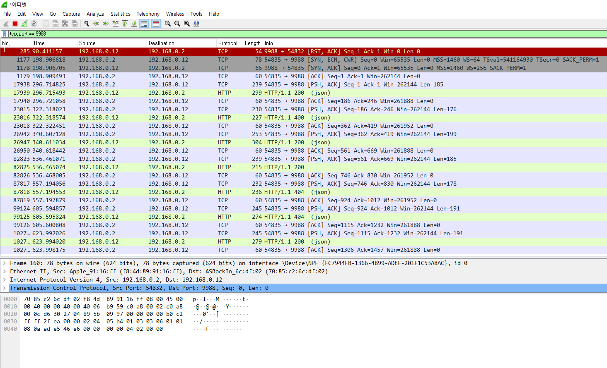
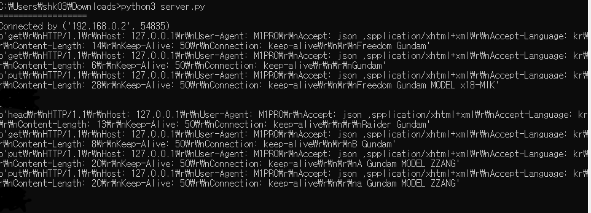
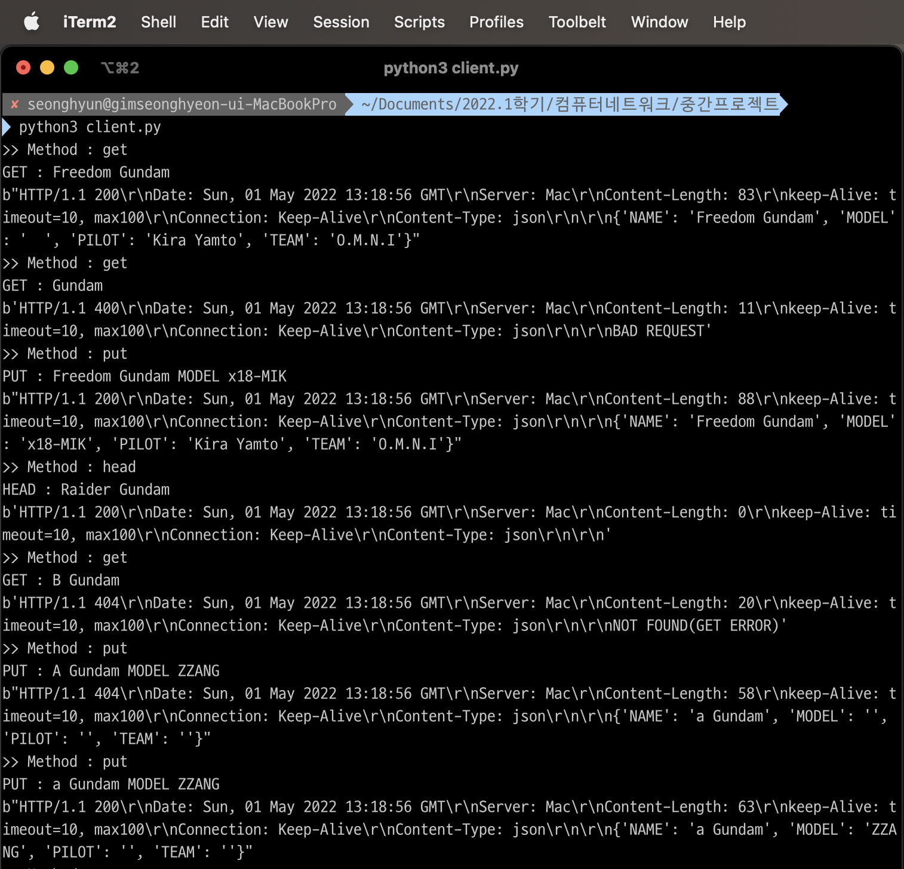
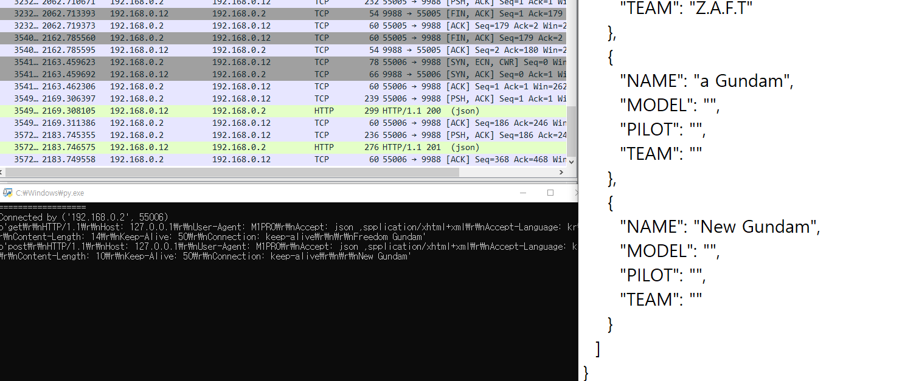

# 중간프로젝트
#

# 실행환경

> 서버 > 윈도우 10 데스크탑 (192.168.0.12)

> 클라이언트 > M1 맥북 (192.168.0.2)

## client.py

#### 서버연결

    HOST = '192.168.0.12' 
    PORT = 9988

    client_socket = socket.socket(socket.AF_INET, socket.SOCK_STREAM)
    client_socket.connect((HOST, PORT))

> IPv4 주소 체계와 TCP 소켓 타입을 통해 통신하였다.

    while True : 

        #HTTP REQUEST MESSAGE

        message = "{}\r\nHTTP/1.1\r\nHost: 127.0.0.1\r\nUser-Agent: M1PRO\r\nAccept: json ,spplication/xhtml+xml\r\nAccept-Language: kr\r\nContent-Length: {}\r\nKeep-Alive: 50\r\nConnection: keep-alive\r\n\r\n{}"
        request = input(">> Method : ")

        if request == 'end' :
            break
            
        elif request == 'exit' :
            break

        elif request == 'get' :
            data = input("GET : ")
            message = message.format(request,len(data),data)

        elif request == 'post' :
            data = input("POST : ")
            message = message.format(request,len(data),data)

        elif request == 'put' : 
            data = input("PUT : ")
            message = message.format(request,len(data),data)
        
        elif request == 'head' :
            data = input("HEAD : ")
            message = message.format(request,len(data),data)
            

        else :
            print("400(BAD REQUEST)")
            continue

        client_socket.sendall(message.encode())

        data = client_socket.recv(1024)
    
        print(data)
        
    client_socket.close()

#

## server.py

    server_socket = socket.socket(socket.AF_INET, socket.SOCK_STREAM)
    server_socket.setsockopt(socket.SOL_SOCKET, socket.SO_REUSEADDR, 1)
    server_socket.bind((HOST, PORT))
    server_socket.listen()
    client_socket, addr = server_socket.accept()

>client.py와 같은 방식의 서버 연결

#

### 메인함수

    while True:

    #HTTP RESPONSE MESSAGE

    message = "HTTP/1.1{}\r\nDate: {}\r\nServer: Mac\r\nContent-Length: {}\r\nkeep-Alive: timeout=10, max100\r\nConnection: Keep-Alive\r\nContent-Type: json\r\n\r\n{}"

    data = client_socket.recv(1024)
    
    if not data:
        break

    request = data.decode().split("\r\n")
        
    try :
        order = request[-1].split(" ",3)
        order[1] != "Gundam"
        unit_name = order[0] + " " + order[1]
    except Exception as e: 
    
        resp =  " 400"
        body = "BAD REQUEST"
        message = message.format(resp,date,len(body),body)
        client_socket.sendall(message.encode())
        continue

    with open('data.json') as f :
            file = json.load(f)

    ## GET Method

    ## POST Method

    ## HEAD Method

    ## PUT Method

     else :
        resp = "400"
        errmes = "BAD REQUEST\r\nCheck Your Method"
        message = message.format(resp,date,len(str(errmes)),str(errmes))  
        client_socket.sendall(message.encode())

#
## GET Method

    if request[0] == 'get' :
        #데이터 비교
        for unit in file['UNIT'] :
            check = 0
            if unit_name == unit['NAME']: 
                check = 1
                resp =  " 200"
                message = message.format(resp,date,len(str(unit)),str(unit))         
                client_socket.sendall(message.encode())
                break

        else:
            resp = " 404"
            errmes = "NOT FOUND(GET ERROR)"
            message = message.format(resp,date,len(errmes),(errmes))         
            client_socket.sendall(message.encode())
            continue
    
> 200(SUCCESS) : key에 해당하는 value를 찾아서 반환 성공  

> 404(NOT FOUND) : key에 해당하는 value를 찾지 못함

> 400(BAD REQUEST) : client가 message를 잘못보냄

#
## POST Method (create)
    elif request[0] == 'post' :

        ...

        for unit in file['UNIT'] :
            if unit['NAME'] == unit_name : 
                check = 1
                resp = " 400"
                ...
            else: 
                check = 0

        if check == 0 :
            newObj = {
                "NAME": unit_name,
                "MODEL": "",
                "PILOT": "",
                "TEAM": ""
            }
            file['UNIT'].append(newObj)
                
            with open('data.json','w') as f :
                json.dump(file,f,indent=2)
                        
            resp = " 201"
            
            ...

> 201(Created) : 리소스 생성

> 400(BAD REQUEST) : client가 message를 잘못보냄
#
## HEAD Method
    elif request[0] == 'head' : 
        
        for unit in file['UNIT'] :
            check = 0
            if unit_name == unit['NAME']: 
                check = 1
                resp =  " 200"
                body = ""
                message = message.format(resp,date,len(str(body)),str(body))
                client_socket.sendall(message.encode())
                break

        else:
            resp = " 404"
            errmes = "NOT FOUND(GET ERROR)"
            message = message.format(resp,date,len(errmes),(errmes))         
            client_socket.sendall(message.encode())
            continue

> GET Method와 비슷하지만 HEAD만 반환

> 200(SUCCESS) : 헤더 반환 성공

> 404(NOT FOUND) : 헤더를 찾지 못함

> 400(BAD REQUEST) : client가 message를 잘못보냄

#
## PUT Method (update)
    elif request[0] == 'put' :

        ...

        for i,unit in enumerate(file['UNIT']) : 
            if unit_name == unit['NAME'] :
                
                if category == 'MODEL' :
                    file['UNIT'][i]['MODEL'] = str(value)
                    print(str(value)+ " ")
                    print(file['UNIT'][i]['MODEL'])
                    resp =  " 200"
                    break
                    
                elif category == 'PILOT' :
                    file['UNIT'][i]['PILOT'] = str(value)
                    resp =  " 200"
                    break

                elif category == 'TEAM' :
                    file['UNIT'][i]['TEAM'] = str(value)
                    resp =  " 200"
                    break    

    ...

> 200(SUCCESS) : 헤더 반환 성공

> 404(NOT FOUND) : 헤더를 찾지 못함

> 400(BAD REQUEST) : client가 message를 잘못보냄

#

# WIRESHARK를 이용한 사용 예시

## WIRESHARK

## SERVER CONSOLE

## CLIENT CONSOLE

> get head put post 사용

#####

post 사용예제

새로운 리소스 생성 확인 가능하다